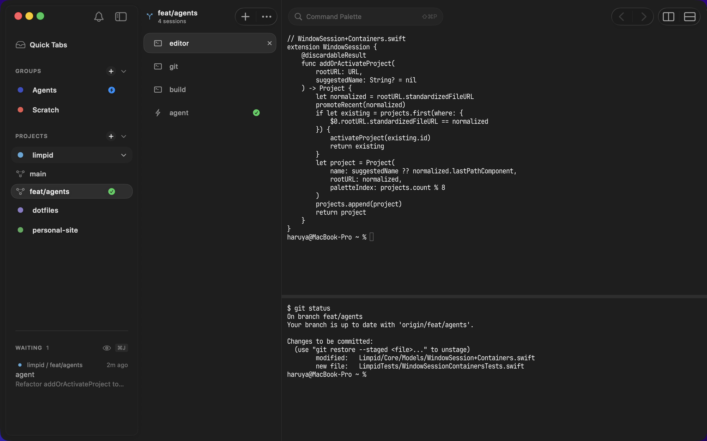

# Limpid

> A calm, native macOS terminal with agent-aware worktrees, built on libghostty.

## Features

### Next-attention cursor (⌘J)
Across every tab and pane, ⌘J jumps to the next agent waiting on you. The WAITING list at the bottom of the sidebar shows the queue in priority order.

### Worktrees as first-class containers
Each git worktree gets its own space. Tabs, panes, and agent sessions stay isolated per branch.

### Claude Code & Codex, together
Both CLIs are recognized natively, with live status, prompt-aware tab names, and per-pane session resume that survives restarts.

### Designed to disappear
A Notes-2026 style sidebar plus Liquid Glass chrome — calm, out of the way, native.

## Install

[Latest DMG](https://github.com/nek0der/limpid/releases/latest) — drag `Limpid.app` to `/Applications`. Sparkle handles updates from then on.

Building from source: [CONTRIBUTING.md](CONTRIBUTING.md#setup).

## Status

Pre-alpha. macOS 26 (Tahoe) and Apple Silicon required.

## Contributing

PRs welcome. See [CONTRIBUTING.md](CONTRIBUTING.md), [SECURITY.md](SECURITY.md), and [CHANGELOG.md](CHANGELOG.md). Questions and ideas go in [Discussions](https://github.com/nek0der/limpid/discussions).

## License

[MIT](LICENSE) © 2026 nek0der
