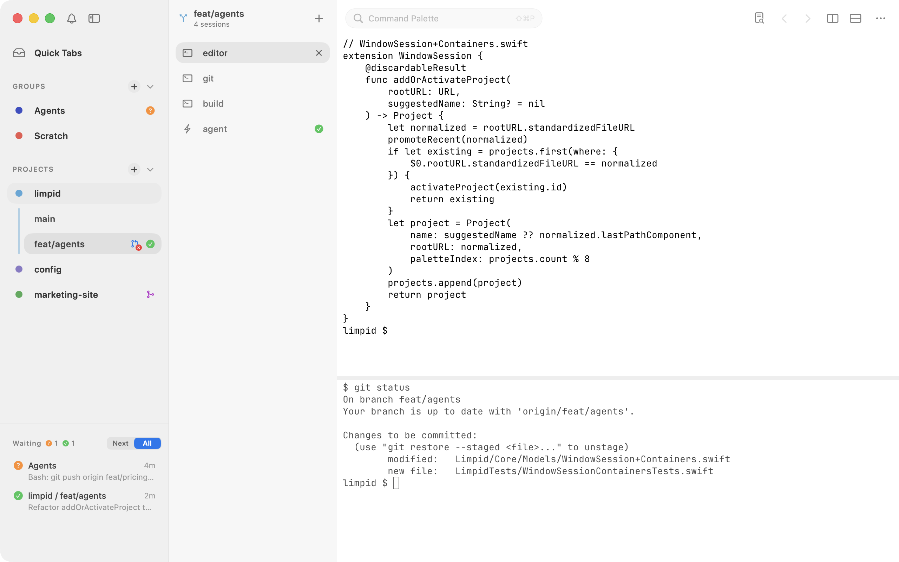

# Limpid

> A calm, native macOS terminal with agent-aware worktrees, built on libghostty.

## Why Limpid

- **Three-column sidebar** — container / tab / terminal stays calm; no nested gimmicks.
- **⌘J jumps to whoever is waiting** — Claude, Codex, or anything that finishes a turn.
- **Worktrees are first-class** — every branch gets its own space, automatically.
- **Native macOS 26** — Liquid Glass toolbar, Sparkle updates, en + ja.

## Features

### Next-attention cursor (⌘J)
Across every tab and pane, ⌘J jumps to the next agent waiting on you. The Waiting list at the bottom of the sidebar shows the queue in priority order.

### Worktrees as first-class containers
Each git worktree gets its own space. Tabs, panes, and agent sessions stay isolated per branch. When Claude `cd`'s into another worktree mid-session, Limpid follows automatically — the matching row activates without you reaching for the mouse.

### Pull request status per branch
A branch with an open request shows it on its sidebar row — open, draft, merged, or closed, with a badge when checks are failing. Hover for the title and CI summary. Off by default; it reads whatever `gh` or `glab` is already signed in on your machine rather than asking for a token of its own.

### Claude Code & Codex, together
Both CLIs are recognized natively, with live status, prompt-aware tab names, and per-pane session resume that survives restarts — including the actual scrollback, not just session IDs.

### Review the diff before you hand it back (⌥⌘R)
Read the branch or the working tree inside Limpid, comment on the lines you want changed, and send the comments to the agent in the pane below as one prompt. Files you have finished with can be marked and hidden, and comments outlive a restart. A comment whose code has moved since you wrote it is held back rather than sent, so the agent never gets a line number that no longer means anything.

When an agent finishes, press ⌘J and Review opens the diff since the prompt was sent. Read it, leave line comments, and send them to the pane below without searching through earlier worktree changes. Use ⌥⌘J to open that turn directly from the focused pane.

### Designed to disappear
A native macOS three-pane sidebar plus a Liquid Glass toolbar — calm, out of the way, native.

## Shortcuts

| Shortcut | Action |
|---|---|
| ⌘J | Jump to next waiting agent |
| ⌥⌘N | New worktree |
| ⌥⌘R | Review changes |
| ⌥⌘J | Review this turn |
| ⌘T | New tab |
| ⌘W | Close pane |
| ⇧⌘P | Command palette |
| ⌘1…⌘9 | Jump to tab N |
| ⌘, | Settings |

All bindings live in `Settings → Keyboard` and are layout-agnostic.

## Install

[Latest DMG](https://github.com/nek0der/limpid/releases/latest) — drag `Limpid.app` to `/Applications`. Sparkle handles updates from then on.

Building from source: [CONTRIBUTING.md](CONTRIBUTING.md#setup).

## Status

Pre-alpha. macOS 26 (Tahoe) and Apple Silicon required. Patch releases per feature — see [Releases](https://github.com/nek0der/limpid/releases).

## Documentation

- [ARCHITECTURE.md](ARCHITECTURE.md) — module map, load-bearing
  files, invariants, and the "How to add X" walkthroughs for new
  tab kinds, container kinds, settings sections, keyboard
  shortcuts, and agents.
- [AGENTS.md](AGENTS.md) — repo conventions + Swift style
  (works for humans and agents).
- [CONTRIBUTING.md](CONTRIBUTING.md) — setup, build, PR
  workflow.
- [SECURITY.md](SECURITY.md) — vulnerability reporting policy.

## Contributing

PRs welcome. See [CONTRIBUTING.md](CONTRIBUTING.md) and [SECURITY.md](SECURITY.md). Questions and ideas go in [Discussions](https://github.com/nek0der/limpid/discussions).

## Acknowledgements

Built on [Ghostty](https://github.com/ghostty-org/ghostty) (libghostty) and [Sparkle](https://github.com/sparkle-project/Sparkle). The full third-party list is in [THIRD-PARTY-NOTICES](THIRD-PARTY-NOTICES).

## License

[MIT](LICENSE) © 2026 nek0der
